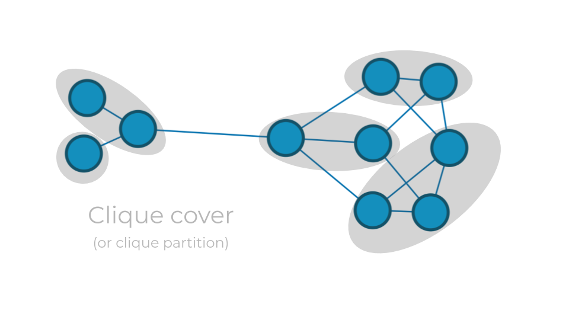

# Study and implementation of algorithms to solve the Minimum Clique Cover NP-Hard problem
- [The Problem](#the-problem)
  - [What's a Clique?](what-s-a-clique)
  - [The Minimum Clique Cover Problem](the-minimum-clique-cover-problem)

* [Exact algorithms](#exact-algorithms)
  * [Brute Force](#brute-force)
  * [Backtracking](#backtracking)
* [Heuristic](#heuristic)

## The Problem
### What's a Clique?
Graphs (also called networks) are composed of *nodes* (or *vertices*) that are related by *edges* (or *links*). A **clique** is a set of nodes in which each node is linked to every other node - you can think of it as a highly cohesive group.

### The Minimum Clique Cover Problem

Finding a *clique cover* of a graph means covering the graph with cliques, so that each node belongs to a clique. Finding a *minimum clique cover* means **finding how to cover the graph with a minimum number of cliques**. The Minimum Clique Cover problem is a *NP-hard problem*, that basically means the optimal solution can't be solved in a reasonable (polynomial) time. Here are some algorithms trying to solve this problem.

## Exact algorithms
### Brute Force

Naive algorithm, trying all the possible combinations of cliques. Is reaaaally slow.

Can be found in `brute_force.py`

### Backtracking

Improvement of the Brute Force algorithm, that is able to stop its exploration of the solution if it is sure that there won't be any viable & better solution with the given configuration. The number of configurations tested is way smaller. Is quicker.

Can be found in `backtrack.py`

## Heuristic

The heuristic used here is a greedy algorithm.

Can be found in `heuristics.py`